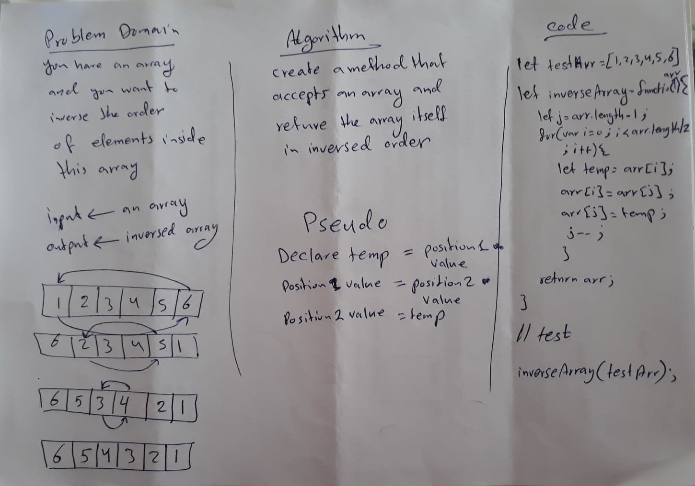
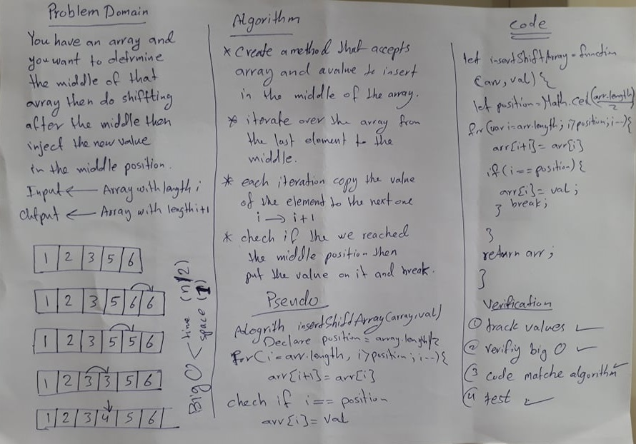

# data-structures-and-algorithms

Content
**No** | **Topic** | **URL**
--- | --- | ---
1   | *__ReverseArray__* | [Reverse an Array]()
2   | *__InsertShiftArray__* | [Insert Shift Array]()

# Reverse an Array
We have an array and we want to reorder it in a reverse order

## Challenge
It is easy to reverse any array using the built in methods. But it is required not to use such as these methods. So this makes it a real challenge.

## Approach & Efficiency
**I started with** looping over the old array and push each element from the old array to a new array.  
**The second one** was the same as the first one but without using the method push. This means taking care about the indexes of the old and new array.
**The third one** was an advanced thinking since I used swapping the values in same array. I think this is the best solution because it is better from time and memory side.

## Solution
<!-- Embedded whiteboard image -->
The final solution was using swapping the values in same array.

# Insert and Shift Array
We have an array and a value that we want to insert in the middle of the array.

## Challenge
There is many ways to implement but the challenge is how to get the result with the minimest Big O of time and space.

## Approach & Efficiency
My Approach was to divide the length of array by 2 then take the result as a position for the value that we want to insert. Then loop from the array.length to the position and each loop decrease the index with 1.
Inside each loop we will assign the value of the index we are looping on it to the next index in order. Then we will check if we reached index value equals to position value then we will assign the value to the index we are looping on. I think the solution efficiency is so good since we only do one loop and there is no decleration for another array.

## Solution
Divide the length of array by 2 then take the result as a position for the value that we want to insert.
Loop from the array.length to the position and each loop decrease the index with 1.
Each loop, assign the value of the index to the next index in order.
Assign the value to the index with value equal to position. 
