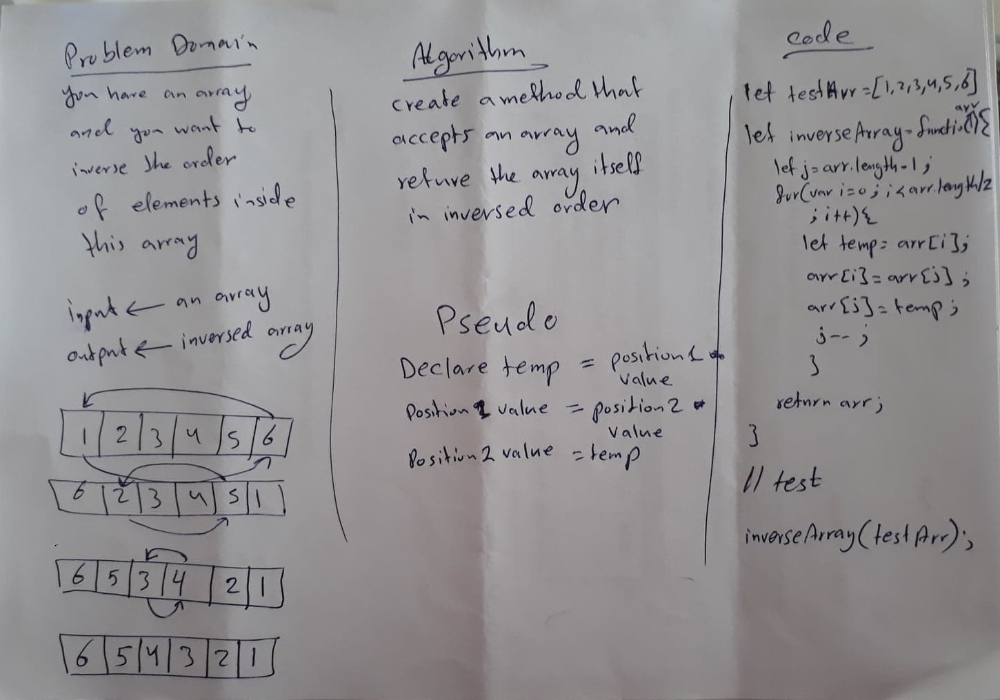

# data-structures-and-algorithms

# Reverse an Array
We have an array and we want to reorder it in a reverse order

## Challenge
It is easy to reverse any array using the built in methods. But it is required not to use such as these methods. So this makes it a real challenge.

## Approach & Efficiency
**I started with** looping over the old array and push each element from the old array to a new array.  
**The second one** was the same as the first one but without using the method push. This means taking care about the indexes of the old and new array.
**The third one** was an advanced thinking since I used swapping the values in same array. I think this is the best solution because it is better from time and memory side.

## Solution
<!-- Embedded whiteboard image -->
The final solution was using swapping the values in same array.
