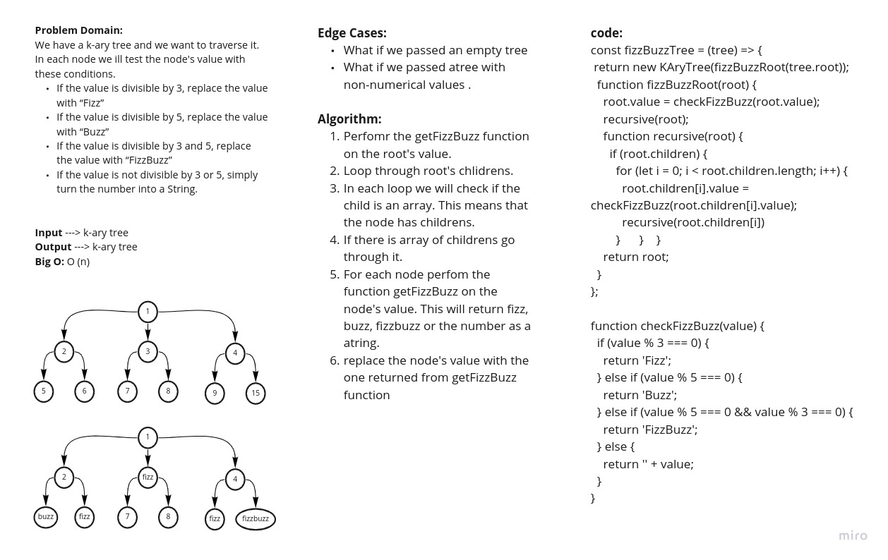

# Fizz buzz on k-ary tree
<!-- Short summary or background information -->
Implement fizz buzz on k-ary tree.
## Challenge
<!-- Description of the challenge -->
Write a function called **FizzBuzzTree** which takes a k-ary tree as an argument.
Without utilizing any of the built-in methods available to your language, determine whether or not the value of each node is divisible by 3, 5 or both. Create a new tree with the same structure as the original, but the values modified as follows:
- If the value is divisible by 3, replace the value with “Fizz”
- If the value is divisible by 5, replace the value with “Buzz”
- If the value is divisible by 3 and 5, replace the value with “FizzBuzz”
- If the value is not divisible by 3 or 5, simply turn the number into a String.

## Approach & Efficiency
<!-- What approach did you take? Why? What is the Big O space/time for this approach? -->
### Tree whiteboard

## API
<!-- Description of each method publicly available to your Stack and Queue-->
### fizzBuzzTree(k-ary tree)
#### return value
Return k-ary tree

