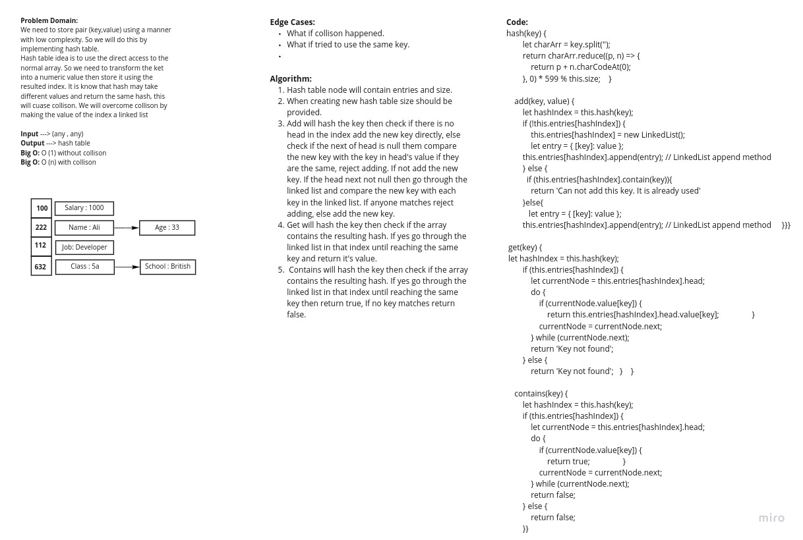

# Hashtables
<!-- Short summary or background information -->
Hash table (hash map) is a data structure that implements an associative array abstract data type, a structure that can map keys to values. A hash table uses a hash function to compute an index, also called a hash code, into an array of buckets or slots, from which the desired value can be found.

## Challenge
<!-- Description of the challenge -->
Implement a Hashtable with the following methods:  
**add**: takes in both the key and value. This method should hash the key, and add the key and value pair to the table, handling collisions as needed.  
**get**: takes in the key and returns the value from the table.  
**contains**: takes in the key and returns a boolean, indicating if the key exists in the table already.  
**hash**: takes in an arbitrary key and returns an index in the collection.

## Approach & Efficiency
<!-- What approach did you take? Why? What is the Big O space/time for this approach? -->
I used hash function to transform the provided keys into a numeric value valid for index. Since we may have the same hash value resulting from two different keys then this is a collision. To overcome collison I used linked list as a value for each index which can contain more than one key and value.
### Big O
Without collison the big O will be O(1)
If there is a collisin the big O will be O(n) since n is the length of the number of values rsulting the same hash "linked list".  

## API
<!-- Description of each method publicly available in each of your hashtable -->
## hash(key)
### Parameters: key to hash
### Return value: hashed value

## add(key, value)
### Parameters: key and value to be added to the hash table
### Return value: no return value

## get(key) 
### Parameters: the key to be searched in the hash table
### Return value: the sored value of the passed key.

## contains(key)
### Parameters: the key to be searched in the hash table
### Return value: true is the key is exist and false if not.
