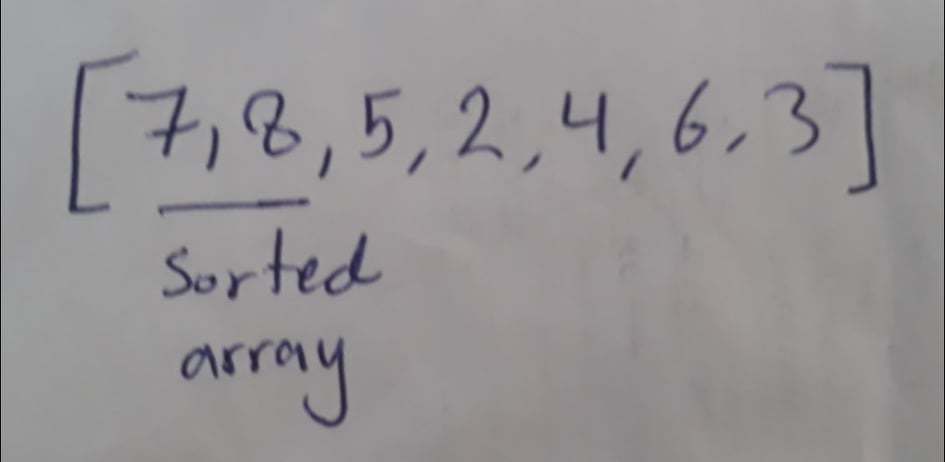
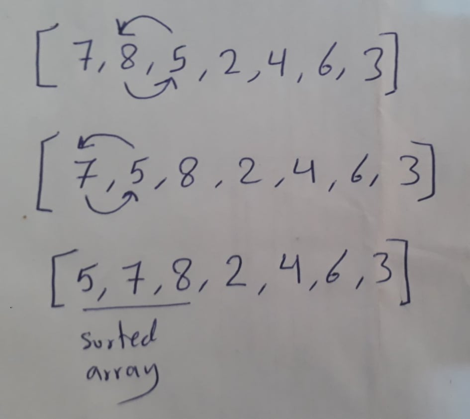
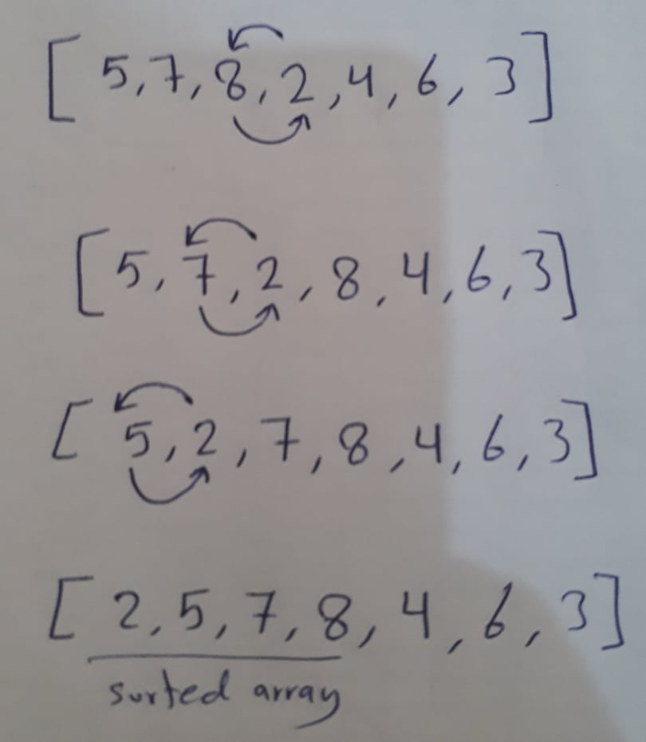
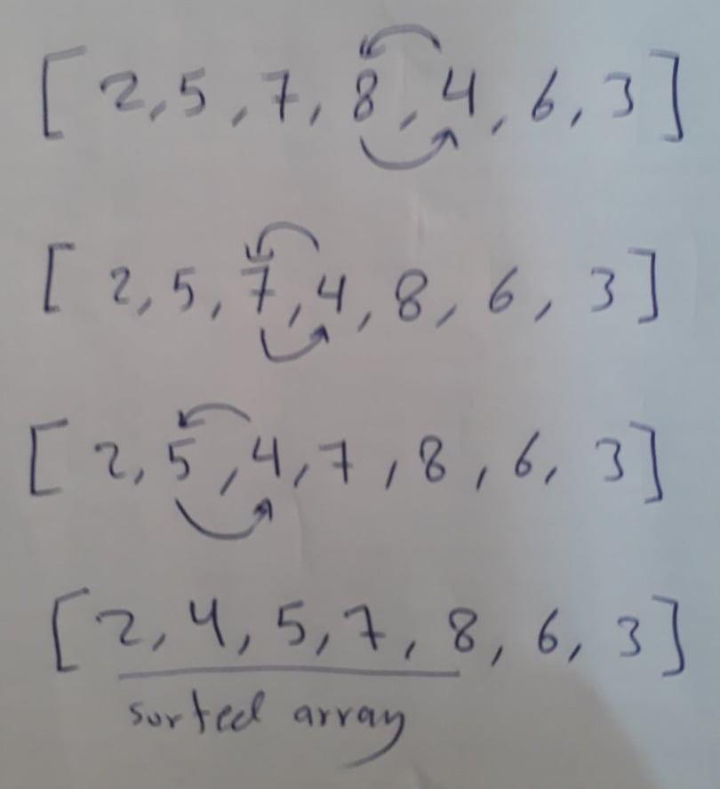
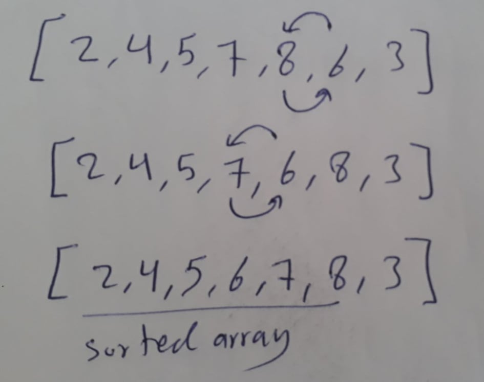
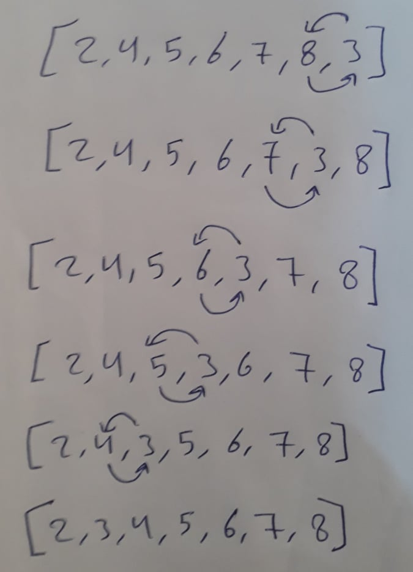

# Insertion Sort
Insertion sort is a simple sorting algorithm that builds the final sorted array (or list) one item at a time. It is much less efficient on large lists than more advanced algorithms such as quicksort, heapsort, or merge sort.

## Pseudocode

 InsertionSort(int[] arr)  
  
    FOR i = 1 to arr.length  
    
      int j <-- i - 1  
      int temp <-- arr[i]  
      
      WHILE j >= 0 AND temp < arr[j]  
        arr[j + 1] <-- arr[j]  
        j <-- j - 1  
        
      arr[j + 1] <-- temp  

## Pass1

In the first pass we will compare the index 1 with index 0. If the value of index 1 is less than the value of index 0 then we will swap them.

## Pass2

Now we have two elements representing sorted array which are indexes 0 and 1. In the second pass we will loop through the sorted array and compare the index 2 with each value on it if if the it is less than then we will swap them.

## Pass3

Now we have three elements representing sorted array which are indexes 0, 1 and 2. In the third pass we will loop through the sorted array and compare starting from index 3 with each value on it if if the it is less than then we will swap them.

## Pass4

Now we have four elements representing sorted array which are indexes 0, 1, 2 and 3. In the fourth pass we will loop through the sorted array and compare starting from index 4 with each value on it if if the it is less than then we will swap them.

## Pass5

Now we have five elements representing sorted array which are indexes 0, 1, 2, 3 and 4. In the fifth pass we will loop through the sorted array and compare starting from index 5 with each value on it if if the it is less than then we will swap them.

## Pass6

Now we have six elements representing sorted array which are indexes 0, 1, 2, 3, 4 and 5. In the sixth pass we will loop through the sorted array and compare starting from index 6 with each value on it if if the it is less than then we will swap them.

