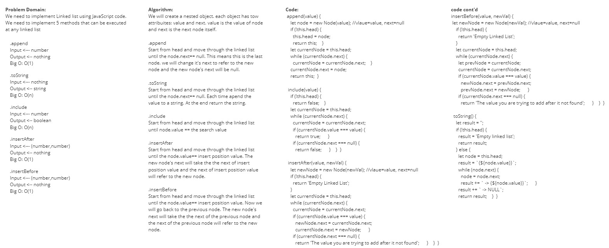
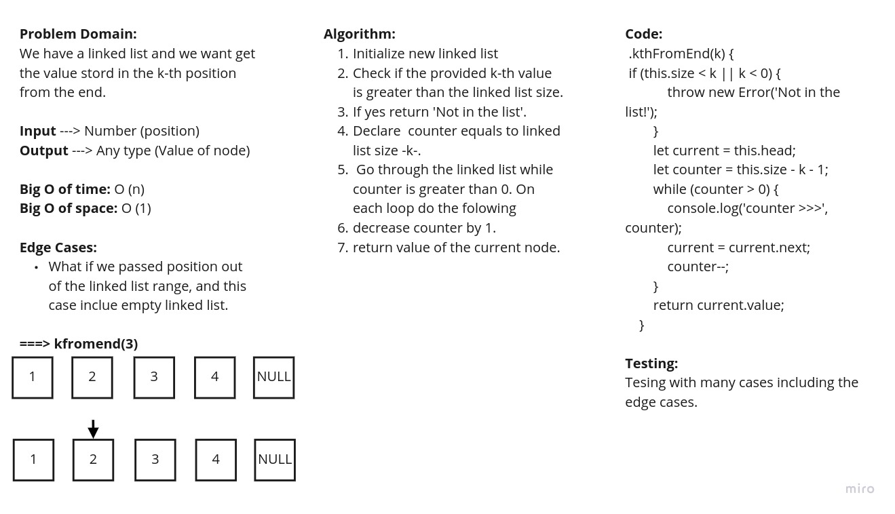
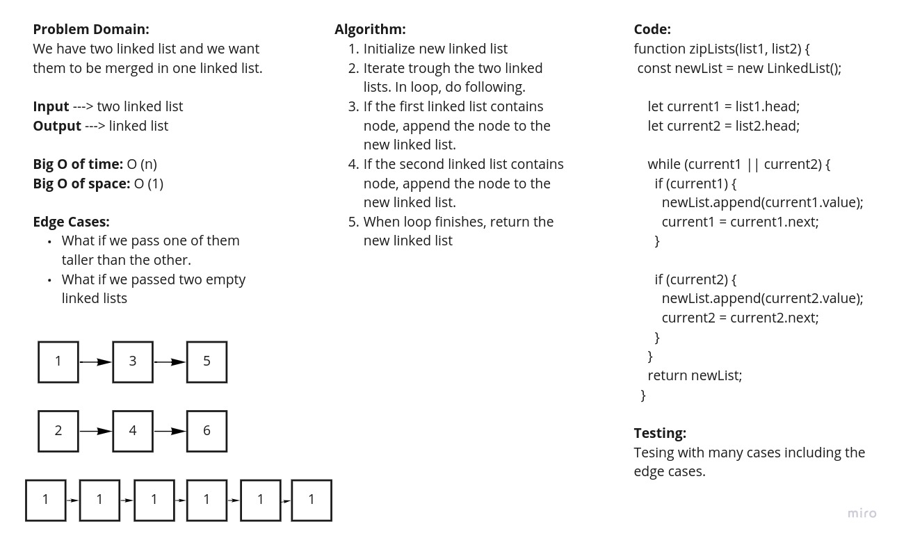

# Singly Linked List
<!-- Short summary or background information -->

## Challenge
### Create a Node class that has properties for the value stored in the Node, and a pointer to the next Node.
Within your LinkedList class, include a head property. Upon instantiation, an empty Linked List should be created.
### Define a method called insert which takes any value as an argument and adds a new node with that value to the head of the list with an O(1) Time performance.
### Define a method called includes which takes any value as an argument and returns a boolean result depending on whether that value exists as a Node’s value somewhere within the list.
### Define a method called toString which takes in no arguments and returns a string representing all the values in the Linked List, formatted as:
`"{ a } -> { b } -> { c } -> NULL"`

## Approach & Efficiency

The Approach depends on checking if is an empty linked in all of the approach's functions. If so, then in include() this will return **false** and in toString() this will return **Empy linked list**.

For include() and toString(): If it is not empty linked list, this means we need to go through the head to tail passing throw each node.
First step is declaring the head as a node then perform a while loop which will loop until node.next becomes false.
In each loop we will take the value of node and store it in a variable then assign node.next to node and this will refer to the next node.
After while loop finished, we will add -> NULL to the end of result's string.
## API
<!-- Description of each method publicly available to your Linked List -->
### .append   (value)
#### Return Values:
`No return value for this method`

### .include(value)
#### Return Values:
##### True:
`It will return true if it found the provided value in the linked list.`
##### False:
`It will return false if it did not found the provided value in the linked list or if the liked list is empty.`

### toString()
#### Return Values:
##### Empty linked list
`I will return the text "Empty linked list" if the linked list is empty`
##### {value1} -> {value2} -> {value3} -> NULL
`It will retuen the content of linked list in the format "{value1} -> {value2} -> {value3} -> NULL".`

### insertAfter(valueToAddAfter,newVaueToAdd)
`This method will add a new node after a specific node`
#### Return Values:
`No return value for this method`

### insertBefore(valueToAddBefore,newVaueToAdd)
`This method will add a new node before a specific node`
#### Return Values:
`No return value for this method`

##### Empty linked list
`It will return the text "Empty linked list" if the linked list is empty`
##### {value1} -> {value2} -> {value3} -> NULL
`It will retuen the content of linked list in the format "{value1} -> {value2} -> {value3} -> NULL".`

### kthFromEnd(index)
`This method will return the value stored in the index starting from the end `
#### Return Values:
`The value stord in the index`

##### Index larger than linked list capacity
`It will return the text "Not in the list!"`
##### kthFromEnd(2)
`If the linked list was {1} -> {2} -> {3} -> {4} -> {5} -> NULL, then it will return 4.`

## Solution
<!-- Embedded whiteboard image -->
### insertion whiteboard

### kthFromEnd whiteboard

### zipLists function
#### input
Two linked lists

#### Return Values:
One linked list resulting from merging process

## Solution
<!-- Embedded whiteboard image -->

