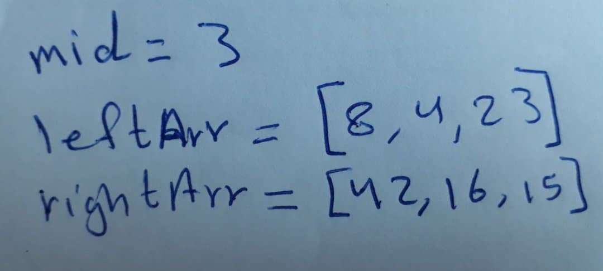
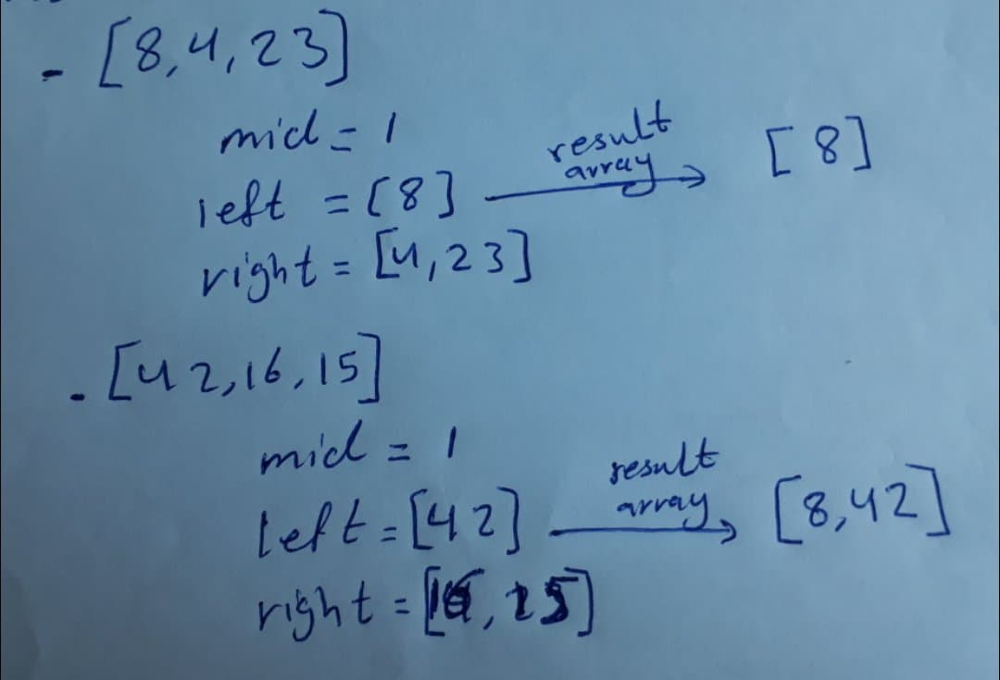
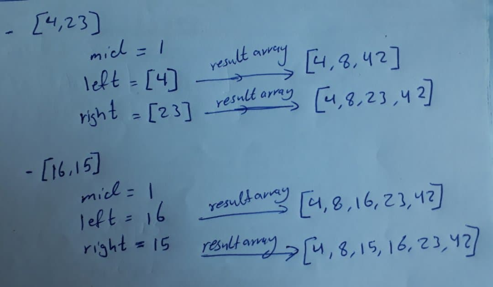

# Insertion Sort
Merge Sort is a Divide and Conquer algorithm. It divides input array in two halves, calls itself for the two halves and then merges the two sorted halves. The merge() function is used for merging two halves. 

## Pseudocode

ALGORITHM Mergesort(arr)
    DECLARE n <-- arr.length
           
    if n > 1
      DECLARE mid <-- n/2
      DECLARE left <-- arr[0...mid]
      DECLARE right <-- arr[mid...n]
      // sort the left side
      Mergesort(left)
      // sort the right side
      Mergesort(right)
      // merge the sorted left and right sides together
      Merge(left, right, arr)

ALGORITHM Merge(left, right, arr)
    DECLARE i <-- 0
    DECLARE j <-- 0
    DECLARE k <-- 0

    while i < left.length && j < right.length
        if left[i] <= right[j]
            arr[k] <-- left[i]
            i <-- i + 1
        else
            arr[k] <-- right[j]
            j <-- j + 1
            
        k <-- k + 1

    if i = left.length
       set remaining entries in arr to remaining values in right
    else
       set remaining entries in arr to remaining values in left

## Pass1

In the first pass we will calculate the mid by dividing the length of array by 2 then devide the array into two arrays left and right. The left from zero to mid-1 and the right from mid to the array length.

## Pass2

Repeat the same function in the past pass until we have an array with only one value that we can compare with another value to generate a sorted array.

## Pass3

Repeat the same function in the past pass until we have an array with only one value that we can compare with another value to generate a sorted array.

