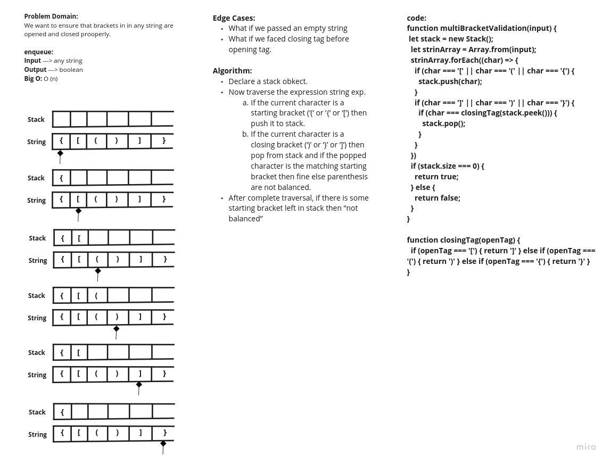

# Multi Bracket Validation
<!-- Short summary or background information -->
Implementaion of validating prooper opening and closing tags

## Challenge
<!-- Description of the challenge -->
Write a function which takes a string as its only argument, and should return a boolean representing whether or not the brackets in the string are balanced. There are 3 types of brackets:

Round Brackets : ()  
Square Brackets : []  
Curly Brackets : {}  

## Approach & Efficiency
<!-- What approach did you take? Why? What is the Big O space/time for this approach? -->
### Whiteboard

## API
<!-- Description of each method publicly available to your Stack and Queue-->
### multiBracketValidation(string) 
#### return values:
True if all brackets are balanced.  
False if anyone of the barackets in not balanced.  

