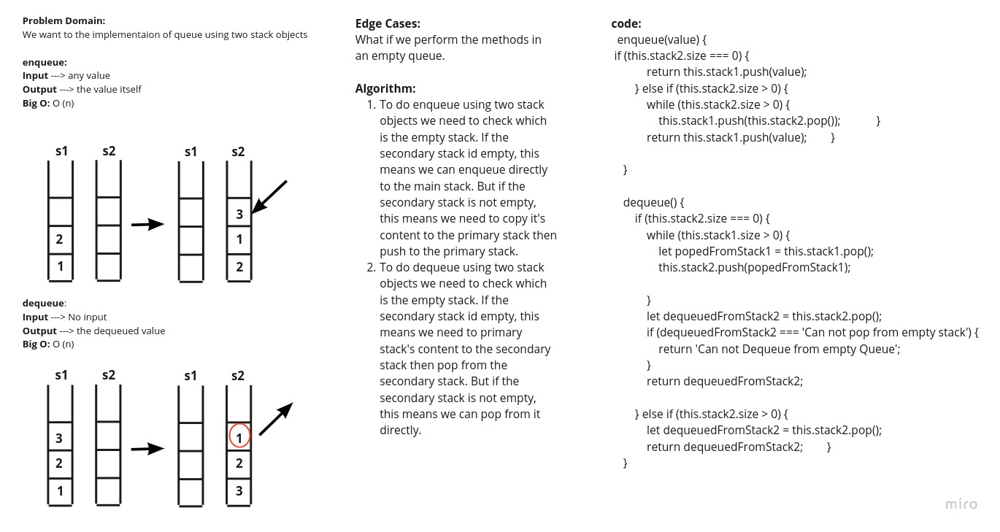

# Stacks and Queues
<!-- Short summary or background information -->
Queue implementaion using two stack objects

## Challenge
<!-- Description of the challenge -->
Create a brand new PseudoQueue class. Do not use an existing Queue. Instead, this PseudoQueue class will implement our standard queue interface (the two methods listed below), but will internally only utilize 2 Stack objects. Ensure that you create your class with the following methods:

### enqueue(value) which inserts value into the PseudoQueue, using a first-in, first-out approach.

### dequeue() which extracts a value from the PseudoQueue, using a first-in, first-out approach.

The Stack instances have only push, pop, and peek methods. You should use your own Stack implementation. Instantiate these Stack objects in your PseudoQueue constructor.

## Approach & Efficiency
<!-- What approach did you take? Why? What is the Big O space/time for this approach? -->
### Whiteboard

## API
<!-- Description of each method publicly available to your Stack and Queue-->
### enqueue(value) 
#### return value
The value of the added node.

### dequeue() 
#### return value
The value of the removed node.

