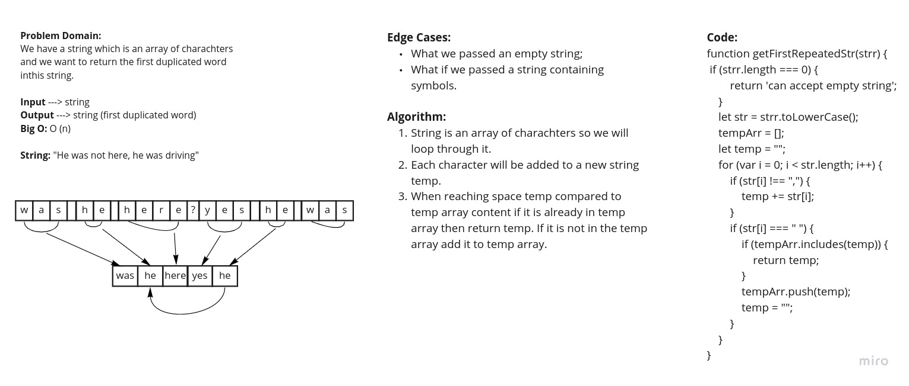

# Challenge Summary
<!-- Short summary or background information -->
Write a function that accepts a lengthy string parameter and return the first word to occur more than once in that provided string.

## Challenge Description
<!-- Description of the challenge -->
Write a function that accepts a lengthy string parameter. Without utilizing any of the built-in library methods available to your language, return the first word to occur more than once in that provided string.

## Approach & Efficiency
<!-- What approach did you take? Why? What is the Big O space/time for this approach? -->
- String is an array of charachters so we will loop through it.
- Each character will be added to a new string temp.
- When reaching space temp compared to temp array content if it is already in temp array then return temp. If it is not in the temp array add it to temp array.

### Big O: O(n)

## Solution
<!-- Embedded whiteboard image -->
