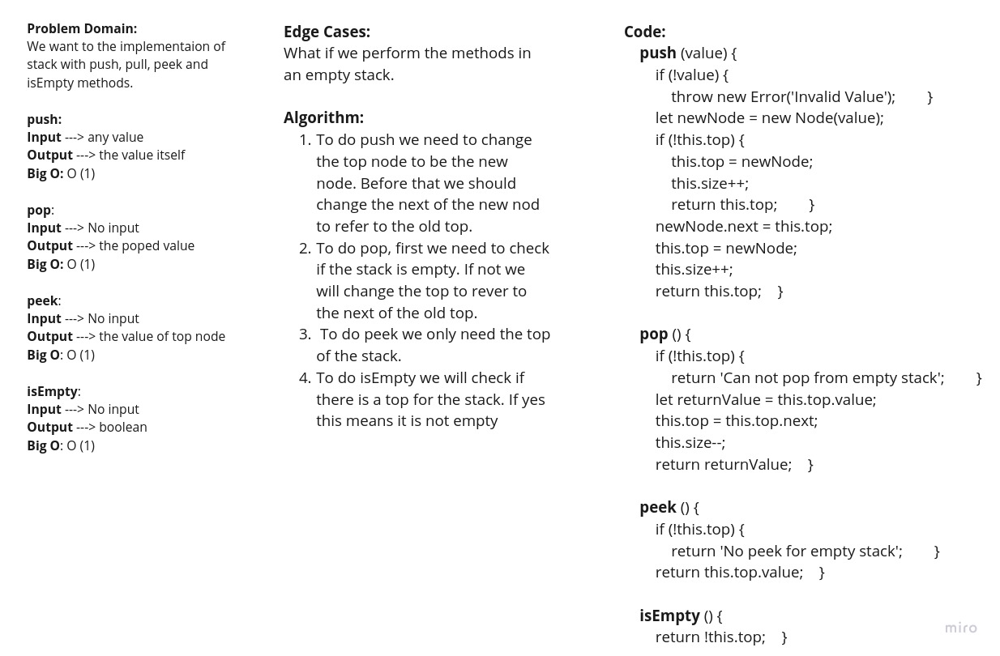
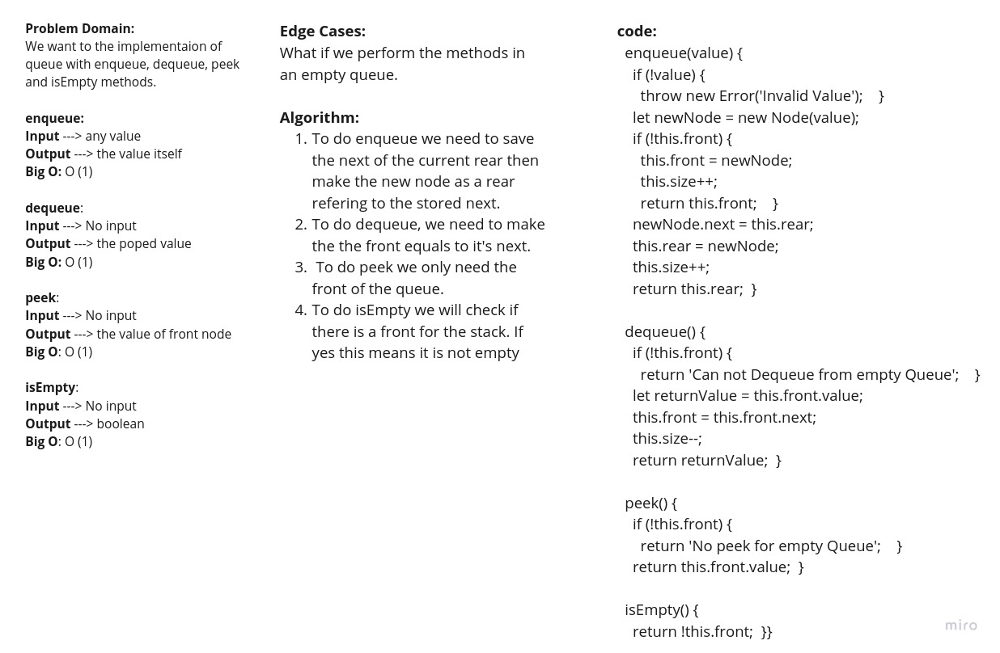

# Stacks and Queues
<!-- Short summary or background information -->
Stack and Queue implementaion using javascript

## Challenge
<!-- Description of the challenge -->
### stack
Create a Stack class that has a top property. It creates an empty Stack when instantiated.
- Define a method called push which takes any value as an argument and adds a new node with that value to the top of the stack with an O(1) Time performance.
- Define a method called pop that does not take any argument, removes the node from the top of the stack, and returns the node’s value. Note that it should raise exception when called on empty stack.
- Define a method called peek that does not take an argument and returns the value of the node located on top of the stack, without removing it from the stack. Note that it should raise exception when called on empty stack
- Define a method called isEmpty that takes no argument, and returns a boolean indicating whether or not the stack is empty.

### queue
Create a Queue class that has a front property. It creates an empty Queue when instantiated.
- Define a method called enqueue which takes any value as an argument and adds a new node with that value to the back of the queue with an O(1) Time performance.
- Define a method called dequeue that does not take any argument, removes the node from the front of the queue, and returns the node’s value. Note that it should raise exception when called on empty queue.
- Define a method called peek that does not take an argument and returns the value of the node located in the front of the queue, without removing it from the queue. Note that it should raise exception when called on empty queue.
- Define a method called isEmpty that takes no argument, and returns a boolean indicating whether or not the queue is empty.

## Approach & Efficiency
<!-- What approach did you take? Why? What is the Big O space/time for this approach? -->
### Stack whiteboard

### queue whiteboard

## API
<!-- Description of each method publicly available to your Stack and Queue-->
## stack methods
### .push(value)
#### return value
The value of the added node.

### .pop()
#### return value
The value of the removed node.

### .peek()
#### return value
The value of the top node.

### .isEmpty()
#### return value
True if the stack is empty/ false if not empty.

## queue methods
### enqueue(value) 
#### return value
The value of the added node.

### dequeue() 
#### return value
The value of the removed node.

### peek() 
#### return value
The front node in the Queue

### .isEmpty()
#### return value
True if the stack is empty/ false if not empty.