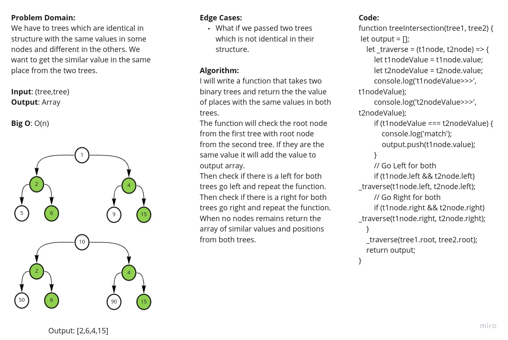

# Stacks and Queues
<!-- Short summary or background information -->
Implement function to get the similar values in silmilar places from two binary trees.
## Challenge
<!-- Description of the challenge -->
Write a function called tree_intersection that takes two binary tree parameters, return a set of values found in both trees.

## Approach & Efficiency
<!-- What approach did you take? Why? What is the Big O space/time for this approach? -->
### Tree whiteboard

## API
<!-- Description of each method publicly available to your Stack and Queue-->
### treeIntersection(tree1,tree2)
#### return value
Return array containg the similar values in similar places in both trees.

